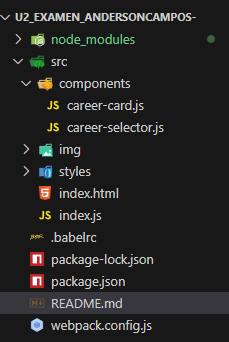
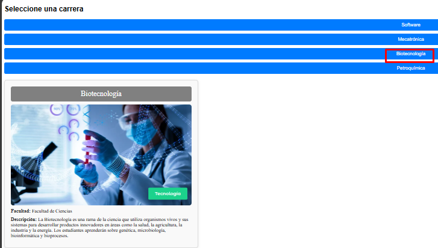

## Descripción

Este proyecto consiste en la creación de una pequeña aplicación interactiva utilizando LitElement, que incluye dos Web Components principales:

1. **Career Selector**: Un componente que muestra una lista de carreras de la Universidad de las Fuerzas Armadas ESPE. Al hacer clic en una carrera, se despliega la información de la carrera seleccionada.
   
2. **Career Card**: Un componente que muestra la información detallada de una carrera seleccionada, como el nombre, facultad, descripción y una imagen. Además, el diseño del componente cambia dinámicamente según un tema basado en el último dígito de la cédula de identidad.

## Tecnologías utilizadas

- **LitElement**: Librería para crear Web Components.
- **Webpack**: Herramienta para empaquetar los módulos y archivos del proyecto.
- **Babel**: Compilador de JavaScript moderno a una versión compatible con la mayoría de los navegadores.
- **HTML, CSS, JavaScript**: Lenguajes de desarrollo web.

## Estructura del Proyecto




## Instrucciones para ejecutar el proyecto

1. Clona el repositorio:

   ```bash
   git clone https://github.com/arquimides12/U2_Examen_AndersonCampos-.git
   ```

Instala las dependencias:

bash
Copiar
Editar
npm install
Inicia el servidor de desarrollo:

bash
Copiar
Editar
npm start
Abre tu navegador y ve a http://localhost:8080 para ver la aplicación en acción.

## Funcionamiento
- El componente career-selector muestra una lista de carreras. Al hacer clic en una carrera, se despacha un evento personalizado con la información completa de la carrera.

- El componente career-card escucha el evento career-selected y actualiza su contenido con la información de la carrera seleccionada, mostrando el nombre, la facultad, la descripción y la imagen asociada.

- Consideraciones
Las imágenes se cargan dinámicamente cuando se selecciona una carrera.

- El tema del componente career-card cambia según el último dígito de la cédula de identidad (para propósitos de ejemplo).

## Licencia

- Este proyecto está bajo la Licencia MIT - consulta el archivo LICENSE para más detalle


#### **2. Guardar el archivo**

Guarda el archivo como **`README.md`** en la raíz de tu proyecto.

---

### **3. Realizar el commit y enviar a GitHub**

Ahora que tenemos el archivo `README.md` listo, vamos a realizar un commit y luego enviar los cambios al repositorio de GitHub.

 **Verifica el estado de los archivos**:

   Abre la terminal en la raíz del proyecto y escribe:

   ```bash
   git status
```
## Ejecucion 

> Primera ejecucion


> segunda ejecucion


> tercera ejecucion


> cuarta ejecucion


